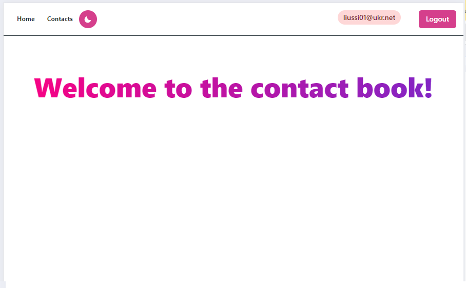
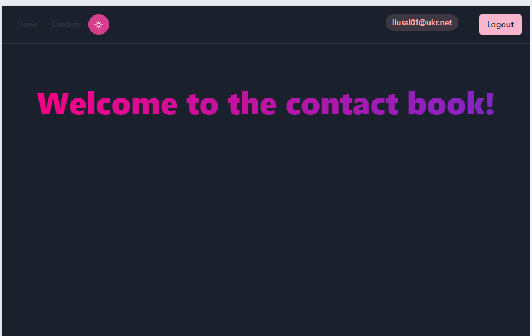
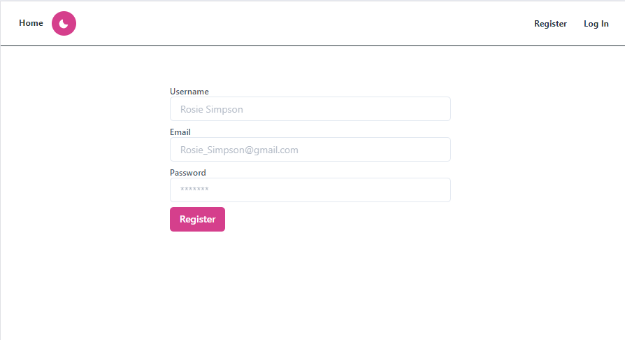
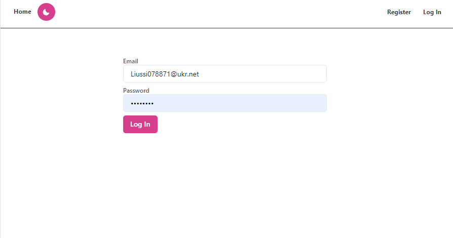
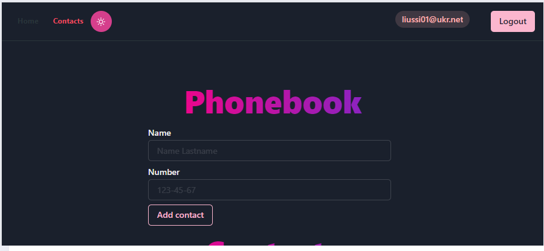
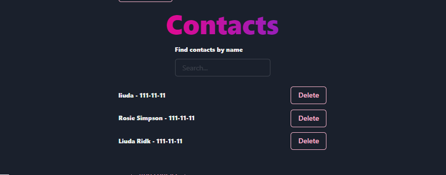

# Phonebook

This project was created using Create React App.
[Create React App](https://github.com/facebook/create-react-app). 

## Phonebook is a web application for managing a list of contacts with both light and dark themes. The application provides users with convenient tools for adding, deleting, and filtering contacts, providing a convenient and efficient way to

## HOME Page

The page features both light and dark themes and buttons on the right side for user registration or login.

## Registration 

On the page, users need to register, and there are placeholders that indicate how to correctly enter values.
page 

## Login

If the user is registered, they can immediately enter their login and password without registering again.
page

## Contacts Page

After registration, your email is highlighted in the top right corner of the screen. There is also a Logout button to log out

### Phonebook

### Contacts

