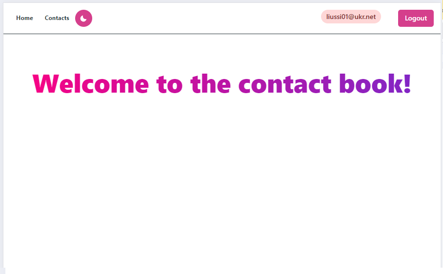
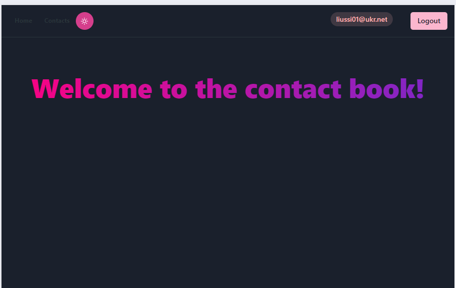
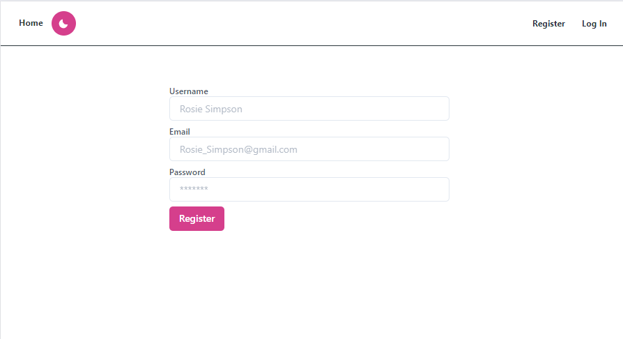
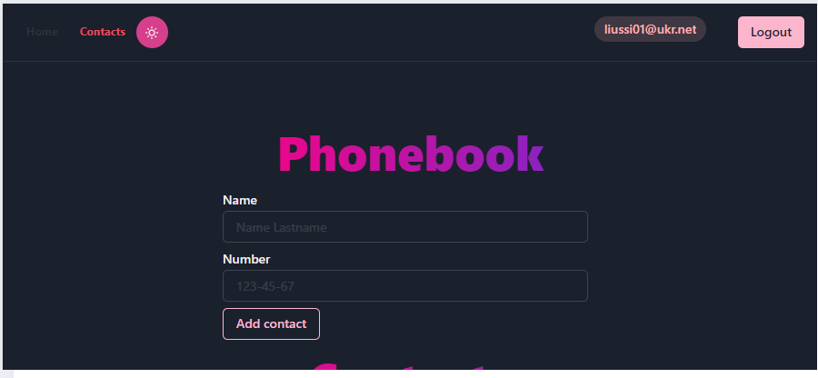

# Phonebook

Цей проєкт був створений за допомогою 
[Create React App](https://github.com/facebook/create-react-app). 

## Phonebook -  це веб-додаток для керування списком контактів з світлою та темною темою. Додаток надає користувачам зручні інструменти для додавання, видалення та фільтрації контактів, забезпечуючи зручний і ефективний спосіб управління персональними контактами.

## Сторінка HOME 

На сторінці присутня як світла так і темна тема та з правої сторони є кнопки для реєстрації або логінізації користувача.

## Реєстрація 

На сторінці потрібно зареєструватись та є плейсхолдери які підказують як правильнно вводити значення. 

## Логін

Якщо користувач зареєстрований то можна одразу ввести логін і пароль та не реєструватись заново.

## Сторінка Контактів

Після реєстраціїї ваш імейл підсвічується в правому куті екрану. Та є кнопка Logout щоб розлогінитись.

### Телефонна книга

### Контакти

